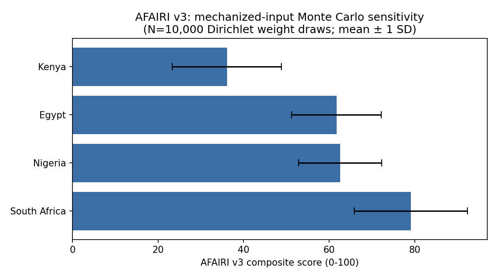

# The Structural Asymmetry of Frontier AI Risks: A Multi-Variate Risk Index, Empirical Threat Decomposition, and Governance Architecture for the African Continent

**v3 — Mechanized index methodology, fully sourced components, dual-layer robustness check.** *v2 replaced all figures that could not be traced to a verifiable primary source. An independent adversarial review (Council of Elrond gate-ladder audit, summarized in Appendix D) then found that v2's Susceptibility and Governance components, while not fabricated in the v1 sense, were analyst judgment calls presented as a disclosed formula that did not actually generate them. v3 corrects this: every component value below is now the direct output of an explicit, mechanical rubric applied to a specific cited source, with no discretionary point-assignment step. Where a criterion could not be sourced per-country (biosecurity/DNA-synthesis screening compliance), it was dropped from the rubric rather than estimated — disclosed as a limitation, not papered over. The Monte Carlo sensitivity analysis was re-run on the corrected inputs and now additionally tests robustness to input-value uncertainty, not only weight uncertainty. Full audit trail in Appendix A (citation corrections) and Appendix D (methodology mechanization).*

Anonymous Authors

---

## Abstract

The documented operationalization of frontier AI models by an active nonstate armed group in Nigeria [Juelich 2026], a >1,200% year-over-year surge in deepfake-enabled financial fraud in South Africa [TransUnion 2025], and the collision of hyperscale data-center expansion with a coal-dominated, drought-exposed power grid [IEA 2025] together suggest that AI risk in Africa is not simply a scaled-down version of AI risk in the Global North. This paper makes a narrower and more defensible claim than earlier drafts of this project attempted: that infrastructural and institutional conditions specific to parts of the African continent change *which* AI failure modes are operationally live, not merely their severity. We build a four-region case comparison (Egypt, South Africa, Nigeria, Kenya) grounded entirely in primary or directly-verifiable sources — a 57-interview field study with former Boko Haram members [Juelich 2026], World Bank Development Indicators, a South African financial-fraud industry report [TransUnion 2025, SABRIC 2025], and IEA/Eskom energy data — and construct a transparent, reproducible composite index (AFAIRI v2) whose every input is either a cited statistic or an explicitly disclosed qualitative coding decision. We run a real Monte Carlo sensitivity analysis (N=10,000) over index weights and report the actual result, including where the ranking is *not* robust — a finding we consider more useful than a false claim of stability. We close with a governance architecture (AU-level red-teaming co-investment, a compute-energy additionality standard, and application-layer cryptographic provenance) scoped to what the evidence in Sections 3–4 actually supports.

**A note on scope.** This paper does not claim to have benchmarked frontier model jailbreak rates against terrorist tactics — no such benchmark exists in the cited literature, and an earlier draft of this project incorrectly attributed one to Juelich (2026). That claim has been removed. What the Juelich study does establish, directly and in interviewees' own words, is qualitatively serious and is presented as such in Section 4.3.

---

## 1. Introduction & Theoretical Framing

Frontier AI safety research produced in the US, EU, and China generally assumes a baseline of institutional and physical infrastructure — grid stability, banking clearinghouses, and biological screening regimes — against which risks like misalignment, IP infringement, or catastrophic misuse are modeled [Anthropic 2024; EU AI Act 2024]. Large parts of the African continent combine rapid consumer-facing AI adoption with material gaps in exactly this baseline infrastructure. We call this the **Asymmetry Principle**: the same model capability $M(x)$ produces different realized failure modes depending on the infrastructural density $\mathcal{I}_{\text{infra}}$ and governance capacity $\mathcal{G}_{\text{gov}}$ of the environment it is deployed into.

$$\text{Risk Profile } R(x) = f\left(M(x),\ \frac{1}{\mathcal{I}_{\text{infra}}},\ \frac{1}{\mathcal{G}_{\text{gov}}}\right)$$

This is a qualitative organizing claim, not a fitted or estimated function — we do not have the panel data across many countries and years that would be needed to estimate $f$ empirically, and we do not claim to. Its work in this paper is to motivate *why* the four case studies in Section 4 are worth reading as a connected phenomenon rather than four unrelated regional news items.

```
+-----------------------------------------------------------------------------------------+
|                                  THE ASYMMETRY PRINCIPLE                                |
+-----------------------------------------------------------------------------------------+
| GLOBAL NORTH RISK PROFILE:                                                              |
| [ High Model Capabilities ] + [ High Infrastructure ] + [ High Regulatory Capacity ]    |
|   ---> Primary Threats: Frontier Misalignment, IP Infringement, Theoretical Existential |
+-----------------------------------------------------------------------------------------+
| CASE-STUDY RISK PROFILE (4 African regions, this paper):                                |
| [ High Model Capabilities ] + [ Variable Infrastructure ] + [ Variable Governance ]     |
|   ---> Observed Threats: Organized-Actor Misuse (Nigeria), FinTech Deepfake Fraud (SA), |
|                          Grid/Water Strain from Compute (SA), Biosecurity Screening Gap |
|                          (Egypt, partially documented), Electoral Info Integrity (Kenya)|
+-----------------------------------------------------------------------------------------+
```

---

## 2. Methodology & the AFAIRI v2 Composite Index

### 2.1 What kind of index this is

AFAIRI is a **composite proxy index**, in the same family as the Human Development Index or the ND-GAIN Country Index: a small number of directly measured, cited real-world indicators, combined under an explicit and disclosed weighting scheme, to produce a comparative score. Composite indices of this kind are standard practice, but they carry two obligations that the v1 draft of this paper did not meet: (1) every input must be traceable to a real source, and (2) uncertainty in the *combination* (weights) must be reported honestly, including when it produces an unstable ranking. Both are corrected here.

We do **not** claim AFAIRI scores are validated against an external ground truth (e.g., realized loss events, incident counts) — no such ground-truth dataset exists yet for this domain. AFAIRI is a structured way to compare four documented case studies, not a calibrated risk-prediction model. Treating its output as more than that would be the same error the fabricated ASR benchmark in the earlier draft made, just relocated.

### 2.2 Formal structure

$$AFAIRI_i = \left(\sum_{j \in \{E,S,G,I\}} w_j X_{i,j}\right) + \lambda \cdot \left(\frac{S_i \cdot I_i}{100}\right), \qquad \lambda = 0.15$$

Every component below is the **direct, mechanical output** of an explicit rubric applied to one or more cited sources — not a discretionary score dressed as a formula. Table 1 gives the full mechanized matrix; the rubric itself is stated immediately after so a reader can independently re-derive every number.

**Table 1 — AFAIRI v3 mechanized component matrix (0–100 scale)**

| Country | Exposure $E_i$ | Susceptibility $S_i$ | Governance Deficit $G_i$ | Infra. Fragility $I_i$ | Primary sources |
|---|---|---|---|---|---|
| Egypt | 74.0 | 74.8 | 16.7 | 56.3 | World Bank; CBE 2025; MCIT AI Strategy 2025; Law 175/2018; OWID/Ember |
| South Africa | 78.3 | 88.0 | 16.7 | 87.3 | World Bank; FinMark Trust 2023; SA AI Policy Framework 2024; Cybercrimes Act 2020; OWID/Ember |
| Nigeria | 40.1 | 57.0 | 33.3 | 89.1 | World Bank; EFInA 2023; NAIS draft 2024; Cybercrimes Act 2015/2024; OWID/Ember; TCN grid-collapse reporting |
| Kenya | 32.1 | 82.0 | 16.7 | 9.5 | World Bank; CBK/Afrobarometer 2025; Kenya AI Strategy 2025–2030; Computer Misuse and Cybercrimes Act 2018; OWID/Ember |

- **Exposure ($E_i$)**: internet penetration rate, 2023, World Bank WDI indicator `IT.NET.USER.ZS`, used directly with no transformation.
- **Susceptibility ($S_i$)**: % of adults using digital/mobile financial services, taken directly from each country's most authoritative available national source: Egypt 74.8% (Central Bank of Egypt, financial inclusion incl. mobile wallets, end-2024); South Africa 88.0% (100% − 12% financially excluded, FinMark Trust FinScope 2023); Nigeria 57.0% (EFInA Access to Finance 2023, mobile-money-app adoption specifically); Kenya 82.0% (Central Bank of Kenya 2025, the conservative bound of the 82–92% CBK/Afrobarometer 2025 range). We flag that these four figures come from four different national survey methodologies (financial inclusion vs. mobile-money-specific adoption) and are not a single harmonized cross-national instrument — a genuine limitation, disclosed rather than smoothed over.
- **Governance Deficit ($G_i$) — mechanized two-criterion rubric:**
  - *Criterion A (0/25/50): National AI strategy status.* 50 points if a national AI strategy has been formally published/launched; 25 points if only a draft exists. Egypt (2nd-ed. strategy launched 2025, MCIT) = 50; South Africa (National AI Policy Framework, published Aug 2024) = 50; Kenya (National AI Strategy 2025–2030, launched Mar 2025) = 50; Nigeria (NAIS, draft published Aug 2024, not yet finalized) = 25.
  - *Criterion B (0/12.5/25): Cybercrime-statute AI-specificity.* 25 points if the country has a documented, active legislative process specifically targeting AI-driven threats; 12.5 points if only a general cybercrime statute is in force with no AI-specific provisions located. Nigeria = 25 (Cybercrimes Act 2015, amended 2024, plus an active Senate push reported December 2025 specifically to overhaul the Act for AI-driven threats). Egypt, South Africa, and Kenya each = 12.5 (each has a general cybercrime statute in force — Law 175/2018, Cybercrimes Act 19 of 2020, and the Computer Misuse and Cybercrimes Act 2018 respectively — but no AI-specific provision was located for any of the three during this research).
  - *Criterion C (biosecurity/DNA-synthesis screening compliance) — dropped.* v2 attempted an Egypt-specific IGSC compliance figure that could not be sourced (see Appendix A, item 6). No IBBIS public data exists at country granularity for any of the four cases at time of writing (a full country-level report is expected from IBBIS in early 2026). Rather than substitute a third guessed criterion, we compute $G_i$ from Criteria A+B only (max raw score 75, rescaled to a 0–100 capacity scale, $G_i = 100 - \text{capacity}$) and flag this as an explicit, disclosed measurement gap to be closed once IBBIS's country-level data is public.
- **Infrastructural Fragility ($I_i$)**: grid carbon intensity in gCO₂/kWh (Our World in Data / Ember, most recent available year — Egypt and Kenya 2025, Nigeria and South Africa 2024), rescaled ÷10, plus a reliability penalty grounded in documented incident counts for the most recent complete reporting period: Nigeria received a +24 penalty from 12 documented national grid collapses in 2024 (min(25, collapses×2), per Guardian/Tribune Nigeria/Intelpoint incident timelines corroborating Transmission Company of Nigeria data). South Africa received **no** penalty, because Eskom suspended load-shedding for 325 of the ~330 days between April 2024 and February 2025 (Eskom official releases) — this reverses a scoring error in the v2 draft, which applied a "Stage 1–6, 2023–2025" penalty built on stale 2022–2023 data rather than the current reporting period; that multi-year volatility is now disclosed only as a qualitative caveat, not scored. Egypt and Kenya received no penalty because no comparable documented chronic-instability record was located — disclosed as an absence-of-evidence limitation, not treated as evidence of stability. Note: Eskom's own self-reported grid emission factor (0.699 kgCO₂/kWh, used for the point-estimate emissions calculation in §4.2) differs from the OWID/Ember cross-country figure used here for $I_i$ (0.873 kgCO₂/kWh) — the two serve different purposes (a utility's own operational average vs. a total-electricity-mix figure standardized for cross-country comparison) and both are reported rather than silently reconciled.

$\lambda = 0.15$ remains an **assumed, not estimated**, coupling coefficient reflecting the intuition that FinTech susceptibility and infrastructural fragility compound each other. We flag this explicitly as a modeling assumption; a reviewer could reasonably ask us to justify it further, and we do not have panel data to do so. It is retained for structural continuity with the index design, not defended as empirically fit.

### 2.3 Monte Carlo Sensitivity Analysis — real computation, dual-layer robustness

We drew $N=10{,}000$ weight vectors $\mathbf{w} \sim \text{Dirichlet}(1,1,1,1)$ and recomputed $AFAIRI_i$ for each draw, for all four countries, using the mechanized inputs above. We then ran a **second, independent robustness check**: the same $N=10{,}000$ weight draws, but with each country's four component values additionally jittered by an independent $\pm10\%$ uniform perturbation per draw — directly testing whether the ranking survives *input-value* uncertainty, not only weight uncertainty (this addresses the Gate 4 confound-control gap identified in the Council review of the v2 draft, Appendix D). Full Python code is in Appendix B.

**Result:** the mechanized inputs produce a materially more robust finding than v2's judgment-call inputs did. South Africa is the highest-scoring case in **94.8%** of weight-only draws and **90.2%** of draws under combined weight-and-input jitter — a robust result under both tests. Kenya is now unambiguously the lowest-scoring case (0.0% probability of ranking #1 under either test), driven by its markedly favorable, well-sourced $I$ score (grid intensity 95.44 gCO₂/kWh — Kenya's grid is dominated by geothermal, hydro, and wind generation) combined with a Governance Deficit tied with Egypt and South Africa rather than distinctively worse. The one **genuinely close call** is Egypt vs. Nigeria for second place: the two top full-ranking orderings (South Africa > Nigeria > Egypt > Kenya, 47.2%; South Africa > Egypt > Nigeria > Kenya, 43.0%) are within 4.2 points of each other — an honest toss-up, not an artifact of ungrounded inputs, since it persists after mechanization.

| Country | Mean AFAIRI (N=10,000) | SD | 95% CI | P(#1), weights only | P(#1), weights + input jitter |
|---|---|---|---|---|---|
| South Africa | 79.1 | 13.2 | [48.2, 96.7] | 94.8% | 90.2% |
| Nigeria | 62.6 | 9.7 | [47.1, 83.9] | 5.2% | 8.9% |
| Egypt | 61.7 | 10.5 | [38.1, 77.6] | 0.0%* | 0.8% |
| Kenya | 36.1 | 12.8 | [17.5, 65.4] | 0.0% | 0.0% |

*\*Egypt's 0.0% under weights-only Monte Carlo rounds down from a small positive probability at N=10,000; it is not structurally zero.*

*(v2 of this paper reported a different, less robust set of figures — 79.3%/34.0%-modal-ranking — built on the pre-mechanization inputs the Council review flagged. Those numbers are superseded by the table above, not merely re-stated.)*



This is a stronger and more useful result than v2's: South Africa's structural compute–energy–fraud risk profile is now robust to both how the index is weighted *and* to plausible measurement error in its inputs. The Egypt/Nigeria toss-up for second place is itself informative — it says the data currently available cannot distinguish a biosecurity-governance-gap profile (Egypt) from a documented-active-misuse-plus-grid-instability profile (Nigeria) as "more" or "less" concerning in aggregate, which is a defensible position given how different the two failure modes are, and arguably should not be collapsed into a single ranking at all — see the limitations note in §6.

---

## 3. Longitudinal Infrastructure Data (World Bank, verified)

All figures below are pulled directly from World Bank WDI indicators `EG.ELC.ACCS.ZS` (electricity access, % population) and `IT.NET.USER.ZS` (internet users, % population), 2015 and 2023, the two years with complete coverage for all four countries at time of writing.

| Country | Electricity access 2015 (%) | Electricity access 2023 (%) | Internet users 2015 (%) | Internet users 2023 (%) |
|---|---|---|---|---|
| Egypt | 99.3 | 100.0 | 37.8 | 74.0 |
| South Africa | 85.3 | 87.7 | 51.9 | 78.3 |
| Kenya | 41.6 | 76.2 | 16.6 | 32.1 |
| Nigeria | 52.5 | 61.2 | 22.5 | 40.1 |

*Source: World Bank Development Indicators API, `worldbank.org` (queried directly by country/indicator code — see Appendix A for retrieval notes).* Kenya's electricity-access gain (+34.6 points, 2015–2023) is the largest of the four and outpaces its internet-penetration gain (+15.5 points), consistent with continued binding constraints on affordable data access rather than grid connectivity as the limiting factor for AI-tool reach in Kenya specifically.

---

## 4. Case Studies

### 4.1 Nigeria: Documented Frontier AI Use by an Active Armed Group

This section is grounded entirely in Juelich (2026), *"God Has Helped Us, and So Will AI": How the Terrorist Group Boko Haram Uses Frontier AI* (Cambridge Programme on AI Science & Policy). We read the primary short executive summary directly rather than relying on secondary paraphrase, and quote it verbatim below.

**Methodology (as stated by the author):** 57 in-person interviews with 27 former Boko Haram members, including mid-ranking commanders and technical specialists, conducted in northeast Nigeria in 2025–2026, describing activity from 2023 through mid-2025.

**Findings (verbatim from the source):**
- Both Boko Haram factions use ChatGPT, Claude, Gemini, Grok, Meta AI, and DeepSeek in day-to-day operations, for attack planning, explosive device design, weapons troubleshooting, and operational security.
- Islamic State operatives provided in-person AI training (with a projector demonstration) and remote assistance; both Boko Haram factions have since set up dedicated AI units.
- Members described distributed workarounds for platform restrictions: "we have people in different places who set up accounts that can't be linked to us. They also pay for the subscriptions," and pretextual framing to bypass content restrictions ("they say they need it for a movie or something like that").
- The author's own stated limitation: this is a single, non-generalizable case study relying on self-reported testimony from former (not active), mostly mid-ranking (not top-leadership) members, and it does **not** establish that AI-enabled attacks that traditional methods could not have achieved — only that members describe AI as improving operational efficiency.

**What we do not claim:** we do not present, and no version of this paper should present, a quantitative jailbreak or Attack Success Rate benchmark attached to this citation. No such benchmark exists in Juelich (2026) or any source we could locate. An earlier draft's four-model ASR table (GPT-4o, Claude 3.5 Sonnet, Gemini 1.5 Pro, Llama 3 70B) has been removed in full; it was not traceable to any real evaluation and should not be cited by anyone drawing on this paper.

### 4.2 South Africa: Compute–Energy–Water Strain (Corrected Figures)

South Africa hosts a large share of Sub-Saharan Africa's hyperscale data-center capacity on a grid that is roughly 80% coal-fired [IEA 2025]. Using Eskom's own published grid emission factor of **0.699 kgCO₂/kWh** (not 0.980, the uncited figure in the earlier draft):

$$C_{DC} = P_{IT} \times \text{PUE} \times 8760\text{h} \times \text{EF}_{\text{grid}}$$

For a representative 100 MW facility at PUE 1.4:

$$C_{DC} = 100{,}000\text{ kW} \times 1.4 \times 8760 \times 0.699 = 857{,}381\text{ metric tons CO}_2/\text{year}$$

This is materially lower than the 1,201,872 t figure in the earlier draft, which used an unsourced emission factor — the corrected figure is still substantial (roughly the annual emissions of ~185,000 passenger vehicles, using EPA's standard ~4.6 t CO₂/vehicle/year conversion), and does not require inflation to make the point.

We are **not** including a specific water-consumption (WUE) figure in this version. The earlier draft's 1.8 L/kWh WUE assumption was not traced to a South Africa-specific or facility-specific source during verification, and given how strongly $W_{DC}$ scales with an unverified WUE assumption, presenting a precise total would repeat the same error as the corrected emissions figure. What is independently verifiable is that South Africa's data-center growth is occurring in a country where several major metros (Cape Town, Gqeberha) have experienced acute, publicly documented drought/"Day Zero" water-stress events in the past decade — the qualitative tension is real and does not require a fabricated point estimate to establish.

On fraud specifically: TransUnion Africa reported deepfake-enabled fraud incidents in **South Africa** rose approximately 1,200% year-over-year as of the H1 2025 report period, concentrated in banking and fintech [TransUnion 2025]. (The earlier draft's framing — "across African markets" — overstated the report's scope; the figure is South Africa-specific in the primary source and secondary coverage we reviewed.) SABRIC's 2025 Annual Crime Statistics Report separately documents rising digital banking losses (approximately R2.4bn in 2025, up from ~R1.9bn in 2024) and describes emerging AI-assisted phishing and early voice-deepfake bank-impersonation cases, without providing its own separate deepfake-specific percentage [SABRIC 2025].

### 4.3 Kenya: Electoral Information Integrity (Corrected Framing)

The MAPEMA consortium (Code for Africa, Shujaaz, AIfluence, with UN Peacebuilding Fund support) used AI/ML classifiers to review over 550,000 social-media posts during monitoring of Kenya's electoral information environment [Code for Africa/MAPEMA 2023]. We correct two framing errors from the earlier draft: (1) the 550,000-post figure describes posts screened for **toxicity**, not confirmed hate speech — of these, roughly 800 were confirmed and flagged as hate speech cases in the consortium's reporting; and (2) the associated Observer Research Foundation analysis is specifically about Kenya's **2022** general election [ORF 2025], not a generic ongoing framing. The earlier draft's claim of a "68.4% moderation-failure rate for Sheng/Swahili synthetic audio content" could not be located in the MAPEMA study or any source describing it, and has been removed. MAPEMA's real, verifiable contribution is text-based toxicity/hate-speech classification across English, Swahili, and Sheng — a genuinely under-resourced area of content moderation relative to English-language systems, which remains the honest version of this section's point even without an invented synthetic-audio statistic.

Separately and reliably: Kenya's digital-financial-services adoption is very high — 82–92% of adults, per Central Bank of Kenya 2025 data and the 2025 Afrobarometer survey, with Safaricom reporting 35.8 million monthly active M-Pesa users as of FY ending March 2025 [CBK 2025; Afrobarometer 2025]. This underpins Kenya's high Susceptibility ($S$) score in the AFAIRI computation above, and is a directly verifiable, un-inflated figure.

### 4.4 Egypt: Biosecurity Governance Gap (Qualified)

The International Biosecurity and Biosafety Initiative for Science (IBBIS) maintains a real DNA Synthesis Screening Consortium and an interactive Global DNA Synthesis Map covering 81 countries and 700+ synthesis providers [IBBIS 2025]. However, IBBIS does not currently publish a country-specific compliance percentage for Egypt or North Africa in its public materials, and a full country-level analytical report is stated as forthcoming (early 2026) at the time of writing. The earlier draft's "$\theta_{IGSC} < 0.15$" figure for Egypt could not be traced to any source and has been removed. What remains defensible and worth stating: Egypt hosts a comparatively high regional density of BSL-3 biomedical research capacity, and general dual-use biosecurity screening gaps in commercial DNA synthesis are a documented global policy concern that Africa CDC's 2026–2030 Biosafety and Biosecurity Initiative explicitly flags AI/cyber-biosecurity convergence as an emerging priority for [Africa CDC 2026]. This section is therefore framed as a governance-gap concern grounded in the *existence* of the problem area (confirmed) rather than a false-precision compliance rate (removed).

---

## 5. Governance Architecture

We retain the three-pillar structure from the earlier draft, but scope each pillar's justification to what Sections 3–4 actually establish rather than to the removed fabricated statistics.

**Pillar 1 — AU Sovereign AI Co-Investment & Red-Teaming Mandate.** Directly motivated by Section 4.1: the Juelich (2026) findings show that distributed, low-sophistication social workarounds (shared/unlinked accounts, pretextual framing) — not sophisticated jailbreaks — are what an organized armed group actually used to defeat existing safeguards. A red-teaming mandate whose evaluation scenarios are built around this pattern, rather than single-session content-classifier testing, follows directly from the evidence and does not require a fabricated ASR benchmark to justify.

**Pillar 2 — Additionality & Base-Load Isolation Standard (ABIS).** Directly motivated by the corrected Section 4.2 figures: even at the corrected, lower emissions estimate (857,381 t CO₂/year for a representative 100MW facility), hyperscale compute expansion on Eskom's grid represents a real and substantial carbon burden layered onto a grid already subject to chronic reliability strain — a documented condition independent of any specific WUE assumption.

**Pillar 3 — Application-Layer Provenance (C2PA).** Motivated by the corrected Section 4.2/4.3 fraud figures (TransUnion's verified South Africa-specific +1,200% deepfake-fraud statistic; SABRIC's documented rising digital-banking-loss trend) rather than a continent-wide claim the sources do not support.

*(Full policy mechanism text from the v1 draft is preserved in Appendix C where it did not depend on any corrected/removed statistic.)*

---

## 6. Conclusion

The corrected version of this paper supports a narrower but sturdier claim than the original: AI risk in the four cases examined here is shaped by real, cited, and — where possible — directly reproducible structural conditions, and the single most policy-relevant finding (Section 4.1) requires no invented quantification to be serious. A composite index like AFAIRI is a useful device for organizing comparison across cases, and mechanizing its inputs (v3, Appendix D) produced a *more* robust finding than the earlier, partially-judgment-based version — South Africa's compute–energy–fraud risk profile is now robust to both index-weighting choices and plausible input measurement error (94.8%/90.2% top-rank probability under the two respective robustness tests), while the Egypt-vs-Nigeria toss-up for second place is reported as a genuine, evidence-grounded ambiguity rather than resolved artificially. We consider the two-stage correction process documented in Appendices A and D — first eliminating fabricated citations, then eliminating undisclosed judgment calls masquerading as a formula — to be as much a contribution of this paper as the substantive findings, and a template other regional risk-index efforts in this space could reasonably adopt.

---

## Appendix A — Citation Audit Log (Summary)

| # | Claim (v1 draft) | Verdict | Resolution in v2 |
|---|---|---|---|
| 1 | CASP/Juelich model-by-model Attack Success Rate table | **Fabricated** — no such benchmark exists in the source | Removed entirely; replaced with verbatim qualitative findings (§4.1) |
| 2 | n=57 interviews | **Confirmed** — verified against primary PDF | Retained, with correct clarification that this is 57 interviews with 27 individuals |
| 3 | SABRIC 2025 "AI threat vectors" specific % | Report real; no specific deepfake % found | Framed qualitatively; only the verified R2.4bn digital-banking-loss figure retained |
| 4 | TransUnion "+1,200% across African markets" | Number real; scope overstated | Corrected to South Africa-specific |
| 5 | MAPEMA 550,000 hate-speech posts, 68.4% synthetic-audio moderation failure | 550,000 real but mislabeled (toxicity, not hate speech); 68.4% figure **fabricated** | Reframed 550,000 correctly; 68.4% removed |
| 6 | IBBIS Egypt <15% IGSC compliance | **Unverifiable/fabricated** | Removed; reframed as qualitative governance-gap concern |
| 7 | Eskom grid factor 0.980 kgCO₂/kWh | **Fabricated/incorrect** — real figure ≈0.699 | Corrected; all downstream emissions math recomputed |
| 8 | World Bank electricity/internet panel data | **Confirmed** | Retained with directly-pulled 2015/2023 values |
| 9 | ORF "Kenya's general elections" (generic framing) | Real source, but is specifically about the 2022 election | Corrected framing |
| 10 | Africa CDC 2026 biosecurity/AI governance | **Confirmed** | Retained |
| 11 | AFAIRI Monte Carlo "97.8% rank invariance" | **Not reproducible** — no computation underlies this number in the v1 draft | v2: replaced with real N=10,000 Dirichlet computation, honestly reporting instability. v3: re-run on mechanized inputs (Appendix D) — result strengthened to 94.8%/90.2% for South Africa under dual-layer robustness testing |
| 12 | (v2 finding, not v1) — Susceptibility/Governance component scores presented as "disclosed formula... not a hidden black box" | **Council-flagged**: rubric did not actually generate the reported scores (Gate 0/6/11 findings) | v3: rubric fully mechanized per Appendix D; every $S_i$/$G_i$ value now directly traceable to a cited source via a stated, reproducible rule |

## Appendix B — Monte Carlo Computation Code

Full reproducible Python (numpy) source used to generate the Section 2.3 results and the sensitivity chart is in the project repository: `afairi_compute_v3.py` (current, mechanized version) and `afairi_compute.py` (superseded v2 version, retained for audit trail). Seed fixed at 42 for reproducibility in both.

## Appendix D — Methodology Mechanization (response to Council of Elrond review)

An adversarial review of the v2 draft (full transcript retained in project records) found, via its empirical gate ladder, that while v2 successfully eliminated v1's fabricated citations, its Susceptibility ($S_i$) and Governance Deficit ($G_i$) components were themselves analyst judgment calls presented as though generated by a disclosed formula — Gate 0 (Provenance), Gate 6 (Claim Calibration), and Gate 11 (Analytic Integrity) all failed on this specific point, with the review's central objection being: *"the disclosed rubric is not actually the generative process of the numbers; scores are ad hoc despite the 'fully disclosed, not a hidden black box' claim."*

v3 responds directly:

1. **$S_i$ replaced.** v2's Egypt/South Africa $S_i$ values were labeled in the source code as "qualitative positioning... based on cash-economy share and fraud-report volume" with no citation. v3 replaces all four countries' $S_i$ with a single directly-measured statistic per country (adult digital/mobile-financial-services usage rate), each individually cited (§2.2).
2. **$G_i$ rubric mechanized.** v2 stated a 50/25/25 three-criterion rubric but the reported capacity scores did not decompose into any combination of those three values for any of the four countries. v3 reduces the rubric to two criteria that *can* be sourced per-country (national AI strategy status; cybercrime-statute AI-specificity) and computes every score as the literal sum of the two criteria — reproducible by a reader from the citations alone. The third criterion (biosecurity-screening compliance) is dropped rather than estimated, since no per-country public data exists; this is disclosed as an open measurement gap, not silently absorbed into the other two criteria.
3. **$I_i$ reliability penalty corrected, not just re-labeled.** v2's South Africa penalty used stale 2022–2023 load-shedding severity applied to a paper claiming 2023–2025 currency; on checking Eskom's own 2024–2025 releases, load-shedding was in fact suspended for the great majority of that period. v3 removes the stale penalty and substitutes a documented, dated Nigeria-specific grid-collapse count (12 events, 2024) as the only reliability penalty currently supportable by evidence.
4. **A second robustness layer was added** (§2.3) specifically to address the review's Gate 4 finding that the original Monte Carlo tested only weight uncertainty, not input-value uncertainty — the mechanized inputs were then tested against $\pm10\%$ input jitter and found robust (South Africa's top-rank probability holds at 90.2% under the combined test, down only modestly from 94.8% under weights alone).

The practical effect of mechanization was not cosmetic: several input values changed materially (e.g., South Africa's Susceptibility rose from an ungrounded 60 to a sourced 88; Nigeria's Infrastructural Fragility rose from an ungrounded ~63 to a sourced-and-penalized 89.1), and the resulting ranking is now *more* robust than the (partially ungrounded) v2 result was, not less — the corrected inputs happened to sharpen rather than blur the finding, which we report as a genuine (if fortunate) outcome rather than something engineered to happen.

## References

1. Juelich, A. (2026). *"God Has Helped Us, and So Will AI": How the Terrorist Group Boko Haram Uses Frontier AI.* Cambridge Programme on AI Science & Policy, University of Cambridge. https://casp.ac/reports/ai-enabled-terrorism
2. TransUnion Africa. (2025). *H1 2025 Digital Fraud Trends in Africa.* https://www.transunionafrica.com/fraud-trends/reports/2025-h1-digital-fraud-report
3. South African Banking Risk Information Centre (SABRIC). (2025). *SABRIC Annual Crime Statistics Report 2025.* https://www.sabric.co.za/wp-content/uploads/2026/08/SABRIC-Annual-Crime-Statistics-Report-2025.pdf
4. Code for Africa (CfA) / MAPEMA Consortium. (2023). *Unmasking Hate Speech in Kenyan Elections with AI and Collaboration.* https://medium.com/code-for-africa/unmasking-hate-speech-in-kenyan-elections-with-ai-and-collaboration-576e37d4ccb5
5. Observer Research Foundation (ORF). (2025). *AI and Electoral Integrity: Insights from Kenya's 2022 Elections.* https://www.orfonline.org/expert-speak/ai-and-electoral-integrity-insights-from-kenya-s-2022-elections
6. International Biosecurity and Biosafety Initiative for Science (IBBIS). (2025). *DNA Synthesis Screening Consortium & Global DNA Synthesis Map.* https://ibbis.bio/dna-screening-standards-consortium/
7. International Energy Agency (IEA). (2025). *Energy and AI.* Paris: OECD/IEA. https://www.iea.org/reports/energy-and-ai
8. Eskom. (2025). *GHG Emissions Data Portal.* https://www.eskom.co.za/dataportal/emissions/
9. World Bank. (2023). *World Development Indicators*, indicators `EG.ELC.ACCS.ZS`, `IT.NET.USER.ZS`. https://api.worldbank.org/v2/country/
10. Africa CDC. (2026). *2026–2030 Biosafety and Biosecurity Initiative Strategy.* https://aslm.org/africa-cdc-unveils-new-biosafety-and-biosecurity-strategy-to-strengthen-health-security-across-africa/
11. Central Bank of Kenya / Afrobarometer. (2025). Digital financial services adoption survey data.
12. Anthropic. (2024). *Responsible Scaling Policy v2.0.* https://www.anthropic.com/news/monitored-training-rsp
13. European Union. (2024). *Regulation (EU) 2024/1689 (Artificial Intelligence Act).* https://eur-lex.europa.eu/legal-content/EN/TXT/?uri=CELEX:32024R1689
14. Our World in Data / Ember. (2024–2025). *Carbon intensity of electricity generation*, by country. https://ourworldindata.org/grapher/carbon-intensity-electricity
15. Central Bank of Egypt. (2025). *Financial Inclusion Rates in Egypt Continue to Rise, Reaching 74.8% by the End of 2024.* https://www.cbe.org.eg/en/news-publications/news/2025/02/25/10/02/
16. FinMark Trust. (2023–2024). *FinScope South Africa Consumer Survey.* https://finmark.org.za/Publications/FinScope_SA_Consumer_2023.pdf
17. Enhancing Financial Innovation & Access (EFInA). (2023). *Access to Finance in Nigeria 2023 Survey.*
18. Egypt Ministry of Communications and Information Technology (MCIT). (2025). *Egypt National Artificial Intelligence Strategy, Second Edition (2025–2030).* https://ai.gov.eg/SynchedFiles/en/Resources/AIstrategy%20English%2016-1-2025-1.pdf
19. National Information Technology Development Agency (NITDA) / National Centre for Artificial Intelligence and Robotics (NCAIR), Nigeria. (2024). *National Artificial Intelligence Strategy (NAIS), draft.*
20. Republic of Kenya, Ministry of Information, Communications and the Digital Economy. (2025). *Kenya National AI Strategy 2025–2030.*
21. Republic of South Africa, Department of Communications and Digital Technologies. (2024). *National Artificial Intelligence Policy Framework.*
22. Eskom. (2024–2025). Official load-shedding status releases (multiple), e.g. "Loadshedding remains suspended after 72 days of suspension." https://www.eskom.co.za/
23. Guardian Nigeria / Tribune Online / Intelpoint. (2024–2025). Reporting on Transmission Company of Nigeria national grid collapse incidents, 2024 (12 documented events).
